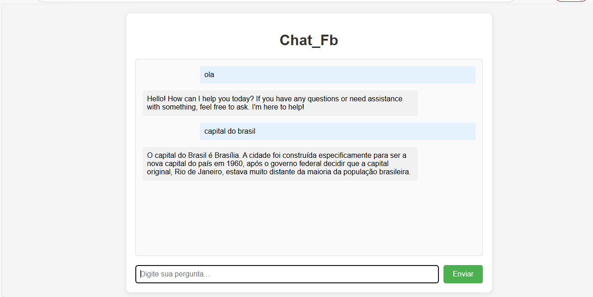

# 🤖 ChatBot Interativo

> Um chatbot inteligente que responde perguntas básicas em português e inglês

## ✨ Funcionalidades

- Responde a saudações em múltiplos idiomas
- Fornece informações geográficas precisas
- Interface simples e intuitiva
- Processamento de linguagem natural básico
- 
## 🚀 Como Usar

# Instalação
- Clone o repositório: Git clone https://github.com/fabriciosergioC/MinhaInteligenciaArtificial.git
  
🛠️ Tecnologias Utilizadas
- HTML5
- CSS3
- JavaScript
- Node.js

